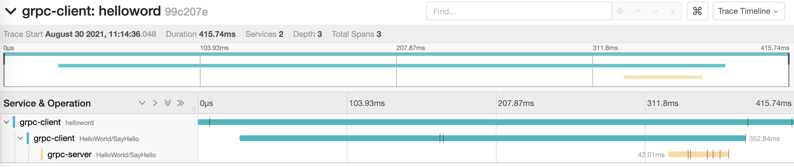

The example project about tracing in grpc api

<div align="center">
    
</div>

## Getting Started

## Project structure
```
.
├── grpc-client
│   ├── Dockerfile
│   ...
├── grpc-server
│   ├── Dockerfile
│   ...
├── docker-compose.yaml
|
└── README.md
```

## Prerequisites
- Make sure that you have Docker and Docker Compose installed
  - Windows or macOS:
    [Install Docker Desktop](https://www.docker.com/get-started)
  - Linux: [Install Docker](https://www.docker.com/get-started) and then
    [Docker Compose](https://github.com/docker/compose)

## Start project
### Start project in local

- Start Jaeger server

```shell script
docker run -d --name jaeger \
  -p 5775:5775/udp \
  -p 6831:6831/udp \
  -p 6832:6832/udp \
  -p 5778:5778 \
  -p 16686:16686 \
  -p 14268:14268 \
  -p 14250:14250 \
  -p 9411:9411 \
  jaegertracing/all-in-one:1.25
```

- Start client service

```shell script
cd grpc-client
mvn clean package
mvn spring-boot:run
```

- Start server service

```shell script
cd grpc-server
mvn clean package
mvn spring-boot:run
```

### Start project in docker 

- Start project

```console
docker-compose up -d
```

- Some request & test


- Stop project
```console
docker-compose down
```

## Send request & watch tracer

- Send test request

```shell script
curl http://localhost:8081/hello
```

- Go to http://localhost:16686/


## Contribute

## Reference