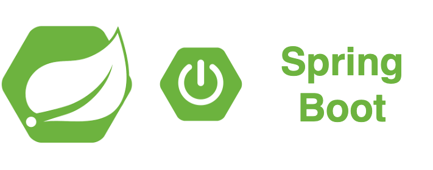

<div align="center">
    
</div>

## Project structure
```
.
├── grpc-client
│   ├── Dockerfile
│   ...
├── grpc-server
│   ├── Dockerfile
│   ...
├── docker-compose.yaml
|
└── README.md
```

## Prerequisites
- Make sure that you have Docker and Docker Compose installed
  - Windows or macOS:
    [Install Docker Desktop](https://www.docker.com/get-started)
  - Linux: [Install Docker](https://www.docker.com/get-started) and then
    [Docker Compose](https://github.com/docker/compose)

## Start project
### Start project in local

- Start Jaeger server

```shell script
docker run -d --name jaeger \
  -p 5775:5775/udp \
  -p 6831:6831/udp \
  -p 6832:6832/udp \
  -p 5778:5778 \
  -p 16686:16686 \
  -p 14268:14268 \
  -p 14250:14250 \
  -p 9411:9411 \
  jaegertracing/all-in-one:1.25
```

- Go to http://localhost:16686/

<div align="center">
    
</div>

- Start client service

```shell script
$ cd grpc-client
$ ../mvnw clean package
...
[INFO] ------------------------------------------------------------------------
[INFO] BUILD SUCCESS
[INFO] ------------------------------------------------------------------------
[INFO] Total time:  28.453 s
[INFO] Finished at: 2022-07-27T13:04:47+07:00
[INFO] ------------------------------------------------------------------------
$ ../mvnw spring-boot:run
2022-07-27 13:06:59,292 INFO DirectJDKLog [main] Starting ProtocolHandler ["http-nio-8081"]
2022-07-27 13:06:59,391 INFO TomcatWebServer [main] Tomcat started on port(s): 8081 (http) with context path ''
2022-07-27 13:06:59,429 INFO StartupInfoLogger [main] Started GrpcClientApplication in 3.547 seconds (JVM running for 3.999)
...
```

- Start server service

```shell script
$ cd grpc-server
$ ../mvnw clean package
...
[INFO] ------------------------------------------------------------------------
[INFO] BUILD SUCCESS
[INFO] ------------------------------------------------------------------------
[INFO] Total time:  19.436 s
[INFO] Finished at: 2022-07-27T13:07:59+07:00
[INFO] ------------------------------------------------------------------------
$ ../mvnw spring-boot:run
...
2022-07-27 13:09:02,461 INFO GrpcServerLifecycle [main] gRPC Server started, listening on address: *, port: 8082
2022-07-27 13:09:02,474 INFO StartupInfoLogger [main] Started GrpcServerApplication in 3.417 seconds (JVM running for 3.979)
```

### Start project in docker 

- Start project

```shell script
$ docker-compose up -d
```

- Some request & test


- Stop project
```shell script
$ docker-compose down
```

## Send request & watch tracer

- Send test request

```shell script
$ curl http://localhost:8081/hello
...
Hello ==> server
```

- Log service grpc-client
```
2022-07-27 13:21:18,370 INFO LoggingReporter [http-nio-8081-exec-1] Span reported: 59bf20f3425133ec:58979b5c139c85c1:59bf20f3425133ec:1 - HelloWorld/SayHello
2022-07-27 13:21:18,415 INFO LoggingReporter [http-nio-8081-exec-1] Span reported: 59bf20f3425133ec:59bf20f3425133ec:0:1 - helloword
```

- Log service grpc-server
```
2022-07-27 13:21:18,368 INFO LoggingReporter [grpc-default-executor-0] Span reported: 59bf20f3425133ec:35b71564d2eac86e:58979b5c139c85c1:1 - HelloWorld/SayHello
```

- Go to http://localhost:16686/


## Contribute

## Reference